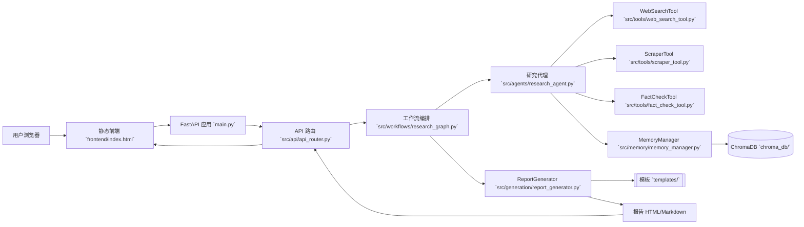
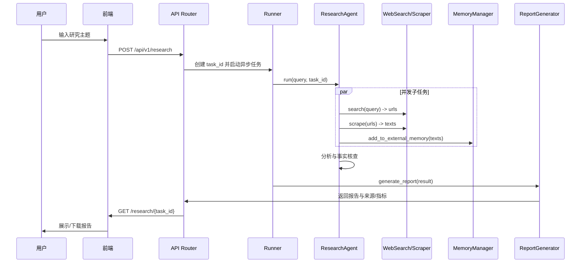
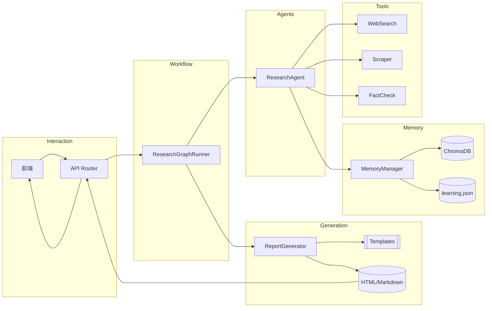

# DeepResearch 项目介绍与架构解析

## 项目背景与目标

- 目标：构建一个面向“主题深度研究”的端到端系统，集成检索、抓取、事实核查、知识记忆与报告生成，产出结构化、可视化且可溯源的研究报告（HTML/Markdown）。
- 使用场景：企业研究、行业趋势分析、竞品情报、技术专题调研、事件追踪与可信度评估。
- 设计理念：分层清晰、工具模块化、异步高并发、可插拔工作流、模板驱动生成、可选向量存储与长期学习优化。

## 技术栈选型与理由

- 后端框架：FastAPI（异步、类型友好、生态成熟），以 `uvicorn` 运行；参考 `main.py:113-121`。
- 模板引擎：Jinja2（模板驱动报告渲染，便于可视化增强与格式统一）。
- LLM 接入：LangChain/LangGraph 可选，支持豆包（Doubao）与 OpenAI，易于切换与编排；参考 `src/agents/research_agent.py:51-94`、`src/workflows/research_graph.py:221-253`。
- 数据抓取与检索：`duckduckgo-search` + `aiohttp` + `BeautifulSoup`，覆盖搜索与稳健抓取；参考 `src/tools/web_search_tool.py`、`src/tools/scraper_tool.py:246-261,276-328`。
- 向量存储：ChromaDB（本地持久化、轻量部署、社区活跃），在嵌入配置完善时启用；参考 `src/memory/memory_manager.py:58-83,118-139` 与 `chroma_db/`。
- 配置管理：集中 `config.py`，支持 `.env`/`.env.local`，方便环境切换与安全管理。

## 总体架构设计

- 分层结构：
  - Interaction 层：前端静态页 + FastAPI 路由
  - Workflow 层：ResearchGraphRunner（LangGraph 或顺序编排）
  - Agents 层：ResearchAgent（规划/执行/分析/核查）
  - Tools 层：WebSearch/Scraper/FactCheck
  - Memory 层：MemoryManager + ChromaDB（可选）
  - Generation 层：ReportGenerator + 模板（HTML/Markdown + Mermaid 可视化）

## 时序图（关键流程）

## 核心功能模块说明

- `main.py`
  - 创建应用与路由挂载：`main.py:62-66`；启动服务：`main.py:113-121`。
- `src/api/api_router.py`
  - 端点：
    - POST `/research` 启动任务（后台执行 `_execute_research_task`）；参考 `src/api/api_router.py:152-181`。
    - GET `/research/{task_id}` 查询结果；GET `/status` 查询状态；GET `/download` 下载报告；参考 `src/api/api_router.py:200-206`。
- `src/workflows/research_graph.py`
  - ResearchGraphRunner：优先 LangGraph（图编排，`221-253`），否则顺序 await；报告生成阶段 `124-181`。
- `src/agents/research_agent.py`
  - LLM 选择与管线：`51-94`；并发子任务执行：`251-287`；研究、分析、核查到报告生成的主流程。
- `src/generation/report_generator.py`
  - `generate_report`：`179-283` 组装动态数据并渲染；`_compose_dynamic_markdown`：`510-614` 增强页（Mermaid、来源矩阵、质量评估、检索路径等）。
- `src/memory/memory_manager.py`
  - 初始化分层内存与向量库：`58-83`；入库外部记忆：`118-139`；统计：`310-345`。
- `src/tools/web_search_tool.py`
  - 查询类型分类（academic/technical/general/tech_news/industry）与来源策展。
- `src/tools/scraper_tool.py`
  - 稳健抓取、Brotli 回退、错误码分类与重试；参考 `246-261, 276-328`。
- `src/tools/fact_check_tool.py`
  - 断言核查与 citation 汇总，输出通过率与细节。
- `src/llm/doubao.py`
  - DoubaoLLM、DoubaoEmbeddings（文本/多模态）封装。

## 代码实现细节解析（选摘）

- 应用初始化与静态前端挂载
  - `main.py:62-66` 注册路由与静态资源：`app.include_router(api_router, prefix="/api/v1")`；`app.mount("/", StaticFiles(directory="frontend", html=True))`。
- 研究任务后台执行与状态管理
  - `src/api/api_router.py:152-169` 在后台创建 `ResearchGraphRunner` 并顺序执行 `run -> assemble -> report`，将状态写入内存 `task_storage`。
- LangGraph 可选编排、顺序回退
  - `src/workflows/research_graph.py:221-253` 检测 LangGraph，若可用则 `StateGraph` 编译并 `ainvoke`；否则按阶段顺序执行。
- 报告生成的动态拼装
  - `src/generation/report_generator.py:254-283` 构建 `dynamic` 内容并调用 `_compose_dynamic_markdown`；`510-614` 渲染 Mermaid、来源矩阵与指标。
- 并发检索/抓取/记忆写入
  - `src/agents/research_agent.py:251-287` `asyncio.gather` 并行子任务；`web_search_tool.search -> scraper_tool.scrape_url -> memory_manager.add_to_external_memory` 组合。
- 外部记忆与向量库启用条件
  - `src/memory/memory_manager.py:58-83` 初始化 embeddings 与 Chroma 集合；当秘钥/端点/模型均有效时启用；`118-139` 完成入库；`chroma_db/` 持久化。

## 模块间交互关系（数据流）

## 配置与持久化

- 集中配置：`config.py` 管理 LLM/向量库/API/日志/模板等；支持 `.env`/`.env.local` 自动加载与覆盖。
- 向量存储：`chroma_db/`（如 `chroma.sqlite3`），学习权重：`chroma_db/learning.json`（来源权重与同义词权重）。
- 模板：`templates/markdown_report.md.j2` 与 `templates/html_report.html.j2`，若缺省则运行时自动创建可用模板。

## 测试与质量保障

- 单元与集成测试覆盖：
  - LLM/Embedding：`tests/test_doubao_llm.py`、`tests/test_doubao_embeddings.py`
  - 报告生成：`tests/test_dynamic_report.py`、`tests/test_report_generator_addons.py`
  - 工具链：`tests/test_web_search.py`、`tests/test_scraper_tool.py`
  - 工作流与策略：`tests/test_memory_compression.py`、`tests/test_parameter_inference.py`

## 非功能性设计

- 性能：
  - 异步 I/O（`aiohttp` 抓取与并发子任务）提高吞吐；可选向量库减少重复处理。
- 可靠性：
  - 工具层错误分类与重试、Brotli 回退、URL 清洗与白/黑名单策略。
- 安全：
  - 敏感键通过 `.env` 与环境变量管理；避免在代码/日志中暴露秘钥。
- 可扩展性：
  - LLM 提供者切换、LangGraph 图编排启用/禁用、向量库替换、来源策展策略可插拔。

## 部署与运行（概览）

- Web 服务：运行 FastAPI 应用（端口默认 `8001`，参考 `main.py:113-121`），前端静态页面挂载于根路径 `/`，API 前缀 `/api/v1`。
- CLI：`scripts/deepresearch.py` 支持命令行生成报告；参数包括 `query/format/out/provider/ark_key/doubao_*` 等（参考 `scripts/deepresearch.py:37-56`）。

## 风险与改进建议

- 任务状态存储当前为内存字典，生产环境建议替换为数据库（如 Redis/PostgreSQL）并增加权限控制与审计。
- 前端为纯静态轮询，后续可引入 WebSocket 以提升实时反馈与进度可视化。
- 抓取对部分站点需要动态渲染支持（如 Playwright），可按需扩展。
- 事实核查可引入多源交叉与置信度贝叶斯聚合，增强稳健性。

## 附录：重要文件清单（按职能）

- 入口与服务：`main.py`、`scripts/deepresearch.py`
- API 与工作流：`src/api/api_router.py`、`src/workflows/research_graph.py`
- 推理代理与工具：`src/agents/research_agent.py`、`src/tools/web_search_tool.py`、`src/tools/scraper_tool.py`、`src/tools/fact_check_tool.py`
- 内存与嵌入：`src/memory/memory_manager.py`、`src/memory/learning_manager.py`、`src/llm/doubao.py`
- 生成与模板：`src/generation/report_generator.py`、`templates/markdown_report.md.j2`、`templates/html_report.html.j2`
- 前端资源：`frontend/index.html`
- 配置与数据：`config.py`、`.env`、`chroma_db/chroma.sqlite3`、`chroma_db/learning.json`

